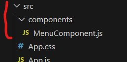
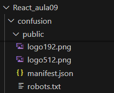
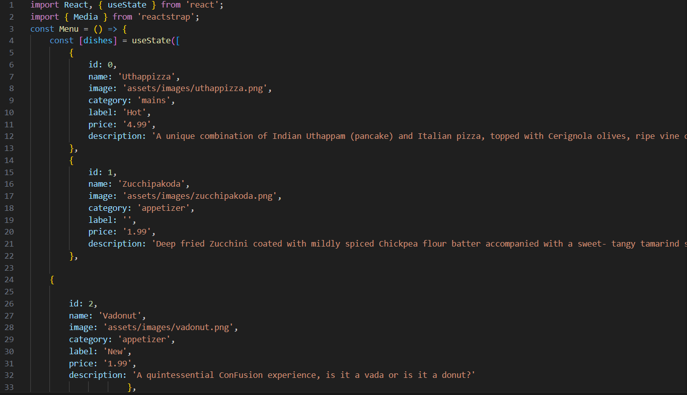
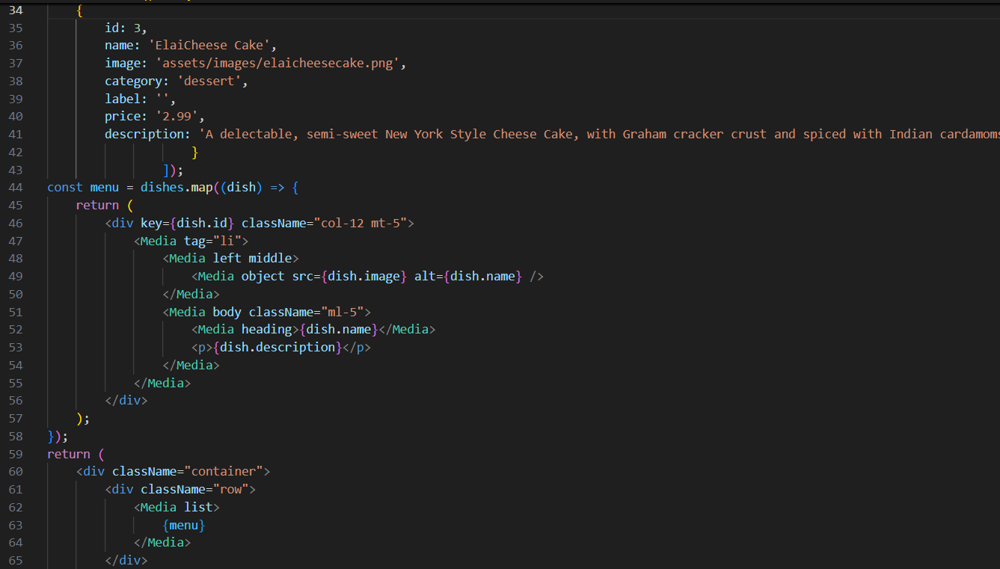
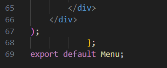
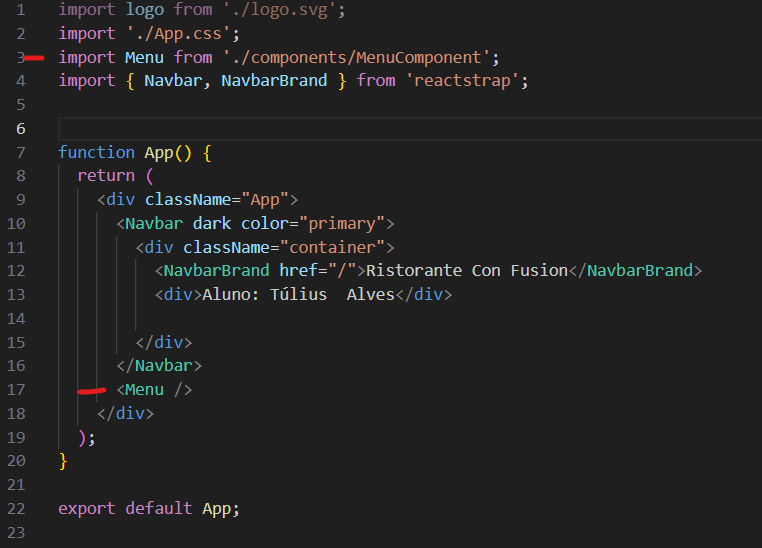

# React_aula09
<h1>Aprendizados da aula </h1>

Nesta aula foi criado um componente chamado Menu dentro do arquivo MenuComponent.js. Este componente terá os dados de pratos
disponibilizados por um estado chamado "dishes" que possuí um array de objetos contendo os pratos.

<h2>Diretório do component</h2>

<h2>Diretório das imagens</h2>

<h2>Códigos </h2>

Após exportar o componente com "export default menu", esse componente precisa ser importado no App.js . Depois ele precisa ser chamado com o comando "< Menu />"

